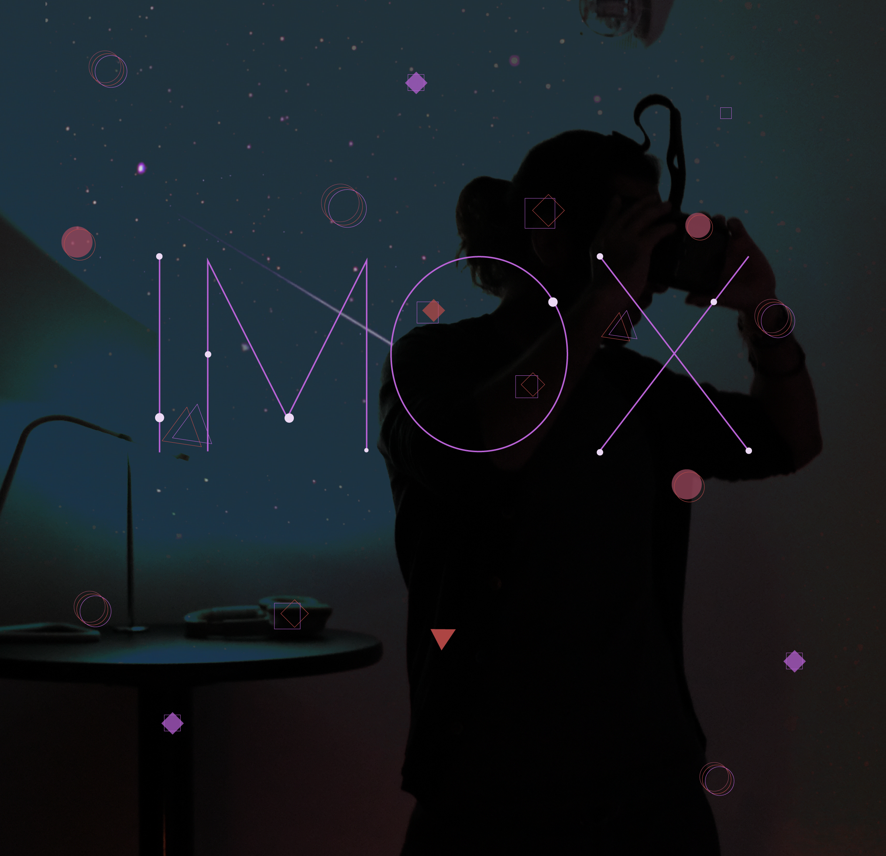

### Become a drop of water and travel through time

Cultures throughout history have practiced healing water rituals. From baptisms, to cleansing rituals, water is used as a symbol for newness and life. As humans our bodies are made up of 60% water and the earth we inhabit is made up of 80% and the same water used today is the same water that existed billions of years ago. 

In [Imox*](https://immigrationcolab.glitch.me/) (ee-moh-sh), a 360 immersive experience, we invite the user to embody a water droplet named Imox while it migrates through the desert and encounters hostility at a man-made border. As Imox remembers their origins as a river, they call upon their ancestors to help them defy adversity.

Water as a force for migration can be seen across the world. The bodies of migrants who die in the mediterranean sea, death via dehydration at the US-Mexico border, and through the push for migration made by Hydroelectric projects in Latin America pushing out indigenous peoples from their rivers. “Mni Wiconi”, Water is Life, shouted the Lakota in opposition to the Dakota Access Pipeline.

 *Imox is a day in the maya calendar, where one give thanks, asks for rain and water.

